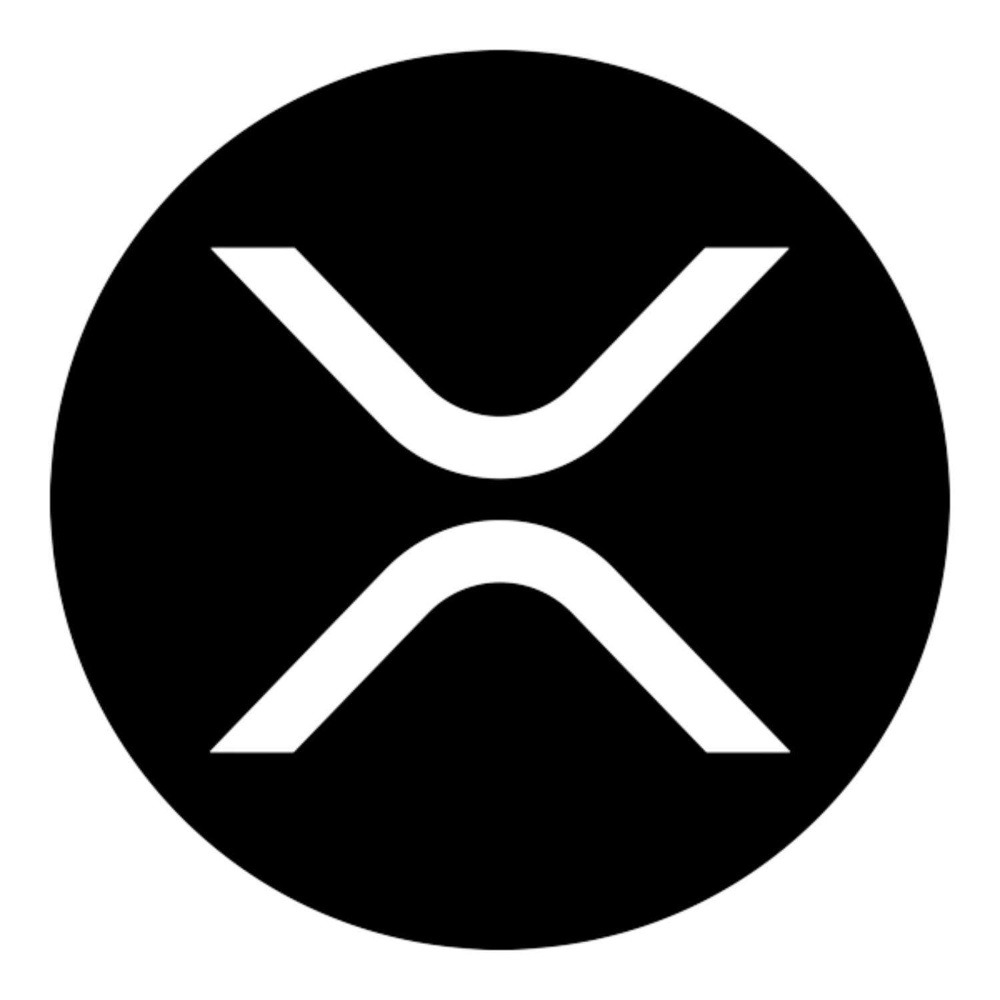
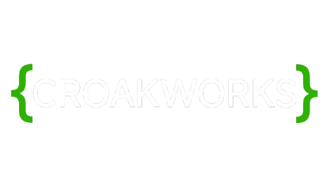

### Next-Generation XRPL Wallet with SnapTap Security

**Secure • Multi-Chain • Feature-Rich**

[🌐 Live Demo](https://one.flipprx.xyz) • [📖 Documentation](https://github.com/cryptoprx/flipprxone) • [💬 Community](https://t.me/flipprx)

---

## ✨ What is FLIPPRX ONE?

**FLIPPRX ONE** is an advanced, self-custodial wallet built for the XRP Ledger with multi-chain support. Featuring revolutionary SnapTap WebAuth security, tiered transaction fees, integrated crypto exchange, NFT marketplace, and cross-chain capabilities for Supra and Coreum networks.

### 🎯 Built For

- 💰 **XRP & Multi-Chain Users** - Manage XRP, Supra, and Coreum assets
- 🪙 **FLIPPRX Token Holders** - Premium features and reduced fees
- 🔄 **DeFi Traders** - Exclusive LP trading with NFT authorization
- 🎨 **NFT Collectors** - Full gallery, marketplace, and pack system
- � **Crypto Traders** - Built-in Changelly exchange integration

---

## 🔐 Security First: SnapTap Technology

FLIPPRX ONE features **SnapTap WebAuth** - revolutionary security that combines:

| Feature | Benefit |
|---------|---------|
| 🔑 **Dual-Key Encryption** | Requires both device + NFC/biometric authentication |
| 🛡️ **AES-256-GCM** | Military-grade encryption with HKDF key derivation |
| 📱 **100% Client-Side** | Your keys never touch any server |
| 🔒 **Zero Backend** | Completely self-custodial architecture |

> **Your keys. Your crypto. Your control.**

---

## 🌟 Core Features

### 💼 Complete Wallet Functionality

<table>
<tr>
<td width="50%">

#### 📤 Send & Receive
- ✅ XRP transactions
- ✅ FLIPPRX tokens
- ✅ All XRPL tokens
- ✅ Real-time balance updates
- ✅ Transaction history

</td>
<td width="50%">

#### 🔄 Import Options
- ✅ 12/24 word seed phrases
- ✅ Family seeds (s...)
- ✅ ed25519 & secp256k1 support
- ✅ Secure backup system

</td>
</tr>
</table>

### 🎨 NFT Gallery

- 🖼️ **View Your Collection** - Beautiful NFT display
- 🌐 **Domain Integration** - On-chain domains for 2M+ FLIPPRX holders
- 🔍 **Detailed Metadata** - Full NFT information
- 📊 **Portfolio Tracking** - Monitor your NFT holdings

### 💱 Micro LP Trading (NFT Authorized)

Exclusive DeFi features for authorized NFT holders:

- 🔄 **Liquidity Pools** - XRP/FLIPPRX, ECP/FLIPPRX, JNT/FLIPPRX, MFLIP/FLIPPRX
- 🔐 **NFT Authorization** - Access requires specific FLIPPRX NFTs
- 💧 **Deposit & Withdraw** - Manage LP tokens seamlessly
- 🔀 **AMM Integration** - Trade directly through automated market makers
- 📈 **Real-Time Rates** - Live pricing and pool statistics

### 💬 MIMO Messenger

**End-to-end encrypted messaging on XRPL**

- 🔐 **Private & Secure** - Messages encrypted on-chain
- 🔔 **Real-Time Notifications** - Never miss a message
- 👥 **Contact Management** - Organize your network
- 💬 **XRPL Native** - Built directly on the ledger

### 🌍 Bilingual Support

**Complete Spanish Language Support**

- 🇺🇸🇪🇸 **English & Spanish** - Full UI translation with 350+ keys
- 🔄 **Real-Time Switching** - Instant language toggle in settings
- 💾 **Persistent Preference** - Language choice saved locally
- 🌐 **Complete Coverage** - All features translated

### 💱 Changelly Exchange Integration

**Buy & Sell Crypto with Fiat**

- 💳 **Buy Crypto** - Purchase XRP and other cryptocurrencies with fiat
- 💵 **Sell Crypto** - Convert crypto to fiat currency
- 🌍 **Global Support** - Multiple countries and payment methods
- 🔒 **Secure** - Integrated Changelly API with address validation

---

## 💎 Premium Features

### ⚡ Tiered Transaction Fees

**Reduced fees for FLIPPRX NFT holders:**

- 🎫 **NFT Holders**: 0.05 XRP per transaction
- 👤 **Non-Holders**: 0.075 XRP per transaction  
- 🌟 **1/1 NFT Holders**: Complete fee exemption (28 exclusive NFTs)
- 💰 **Fair & Transparent** - Support wallet development

### 🌐 Multi-Chain Support

**Beyond XRPL - Manage Multiple Blockchains:**

- ⚡ **Supra Network** - Activate Supra wallet from your XRPL seed
- 🔷 **Coreum Network** - Activate Coreum wallet integration
- 🔄 **Cross-Chain** - Manage multiple chains from one interface
- 🔐 **Unified Security** - Same SnapTap security across all chains

## 🚀 Why Choose FLIPPRX ONE?

| Traditional Wallets | FLIPPRX ONE |
|:-------------------:|:-----------:|
| Password only | 🔐 SnapTap Dual-Key + Biometric |
| Single chain | 🌐 Multi-chain (XRPL, Supra, Coreum) |
| No exchange | 💱 Built-in Changelly |
| Limited NFT support | 🎨 Full gallery + marketplace + packs |
| No messaging | 💬 Encrypted MIMO messenger |
| Standard fees | 💎 Tiered fees for NFT holders |

---

## 🎮 How It Works

### 1️⃣ Create or Import Your Wallet

Choose your preferred method:
- 🆕 **Create New** - Generate a secure wallet with SnapTap
- 📥 **Import Existing** - Use seed phrase, family seed, or Xaman numbers
- 🔒 **Secure Backup** - Save your recovery phrase safely

### 2️⃣ Authenticate Securely

- 📱 **WebAuth** - Tap NFC tag or use device biometrics
- 🔑 **Password** - Traditional password option available
- ✅ **Transaction Signing** - Every action requires authentication

### 3️⃣ Manage Your Assets

- 💰 **View Balances** - Real-time XRP and token balances across chains
- 📤 **Send Payments** - Quick transactions with tiered fees
- 🔄 **Trade LP Tokens** - Access exclusive Micro LP pools (NFT required)
- 💱 **Buy/Sell Crypto** - Integrated Changelly exchange
- 💬 **Message Contacts** - Secure MIMO messenger
- 🎨 **Browse NFTs** - Your complete collection
- 📦 **Open Packs** - Purchase and reveal NFT packs

---

## 🛠️ Technology Stack

Built with modern, battle-tested technologies:

- ⚛️ **Next.js 15** - React framework for production
- 🔐 **SnapTap WebAuth** - NFC/biometric authentication
- 🌐 **xrpl.js** - Official XRPL JavaScript library
- ⚡ **Supra L1 SDK** - Supra blockchain integration
- 🔷 **CosmJS** - Coreum blockchain integration  
- 💱 **Changelly API** - Crypto exchange integration
- 🌍 **i18n System** - Custom translation system with 350+ keys
- 🔒 **Web Crypto API** - Browser-native encryption
- 🎨 **Tailwind CSS** - Modern, responsive design
- 💾 **Prisma + PostgreSQL** - Domain Depot database
- 🔊 **Sound Effects** - Enhanced UX with audio feedback

---

## 📱 Platform Support

| Platform | Support |
|:--------:|:-------:|
| 🌐 **Web** | ✅ Full Support |
| 💻 **Desktop** | ✅ All Browsers |
| 📱 **Mobile** | ✅ Responsive Design |
| 🔐 **NFC** | ✅ WebAuth Compatible |

---

## 🔒 Security & Privacy

### Our Commitment

- ✅ **Self-Custodial** - You control your private keys
- ✅ **No Data Collection** - Zero tracking or analytics
- ✅ **Open Source** - Transparent and auditable
- ✅ **Client-Side Only** - No server-side key storage
- ✅ **Encrypted Everything** - AES-256-GCM encryption

### ⚠️ Important Security Notes

> 🔐 **Always backup your seed phrase** - Store it securely offline  
> 🚫 **Never share your seed** - No one legitimate will ask for it  
> ✅ **You are in control** - This is true self-custody  
> 🔒 **Enable SnapTap** - Maximum security with dual-key authentication

---

## 🌍 For the Community

FLIPPRX ONE is built by the community, for the community:

- 👥 **2M+ FLIPPRX Domain** - Exclusive features and domains
- 🤝 **Open Source** - Contribute and improve
- 💡 **Community Driven** - Your feedback shapes development
- 🌐 **Global Access** - Available worldwide, no restrictions

---

## 🚀 Getting Started

### Quick Start

1. **Visit the Wallet** - [Launch FLIPPRX ONE](#)
2. **Create/Import** - Set up your wallet in seconds
3. **Secure It** - Enable SnapTap for maximum security
4. **Start Using** - Send, receive, trade, and message!

### No Installation Required

FLIPPRX ONE runs entirely in your browser. No downloads, no installations, no hassle.

---

## 🤝 Community & Support

### Join Our Growing Community

---

## 🎯 Feature Highlights

### ✅ Fully Implemented
- ✅ **SnapTap WebAuth** - Dual-key NFC/biometric security
- ✅ **Multi-Chain** - XRPL, Supra, Coreum support
- ✅ **Bilingual Support** - Complete English & Spanish translation (350+ keys)
- ✅ **Tiered Fees** - Reduced fees for NFT holders
- ✅ **Changelly Exchange** - Buy/sell crypto with fiat
- ✅ **LP Trading** - NFT-authorized liquidity pools
- ✅ **NFT Gallery** - View and manage your NFT collection
- ✅ **NFT Search & Offers** - Search wallets and check incoming transfers
- ✅ **MIMO Messenger** - Encrypted on-chain messaging
- ✅ **DApp Connector** - Connect to XRPL dApps
- ✅ **Transaction History** - Complete audit trail with status tracking
- ✅ **Trustline Manager** - Easy token management with LP support
- ✅ **Domain Manager** - 2MCLUB domain claiming for holders
- ✅ **Sound Effects** - Enhanced user experience
- ✅ **Address Validation** - Real-time crypto address verification

### 🚧 In Progress
- 🔄 **NFT Pack Marketplace** - Purchase and reveal collectible NFT packs with RLUSD
- 🔄 **Domain Depot** - Genesis domain system for FLIPPRX holders
- 🔄 Additional blockchain integrations
- 🔄 Enhanced NFT features
- 🔄 Advanced trading tools
- 🔄 Mobile optimization

---

## 💎 Powered By

### SnapTap Security Technology

Revolutionary NFC/WebAuth authentication for unparalleled security.

**Learn more:** [snap.croak.work](https://snap.croak.work)

---

## 📄 License

This project is licensed under the **MIT License** - see the [LICENSE](LICENSE) file for details.

---

## ⚡ Quick Links

- 🌐 **Website** - [flipprx.one](#)
- 📱 **Launch Wallet** - [one.flipprx.xyz](#)
- 📖 **Documentation** - [flipprx.xyz](#)
- 💬 **Support** - [admin@croak.work](#)
- 🐦 **Twitter** - [@_flipprx_](https://x.com/_flipprx_)

---

### 🌟 Star This Repository

If you find FLIPPRX ONE useful, please consider giving it a star! ⭐

**Built with ❤️ for the XRPL & FLIPPRX Community**

---

© 2025 FLIPPRX ONE. CROAKWORKS. All rights reserved.

**Your Keys. Your Crypto. Your Future.**

