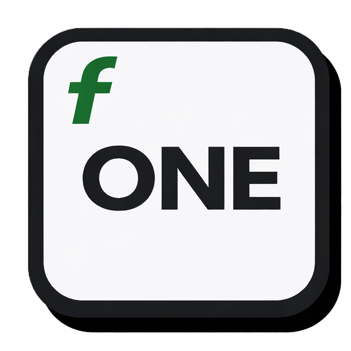
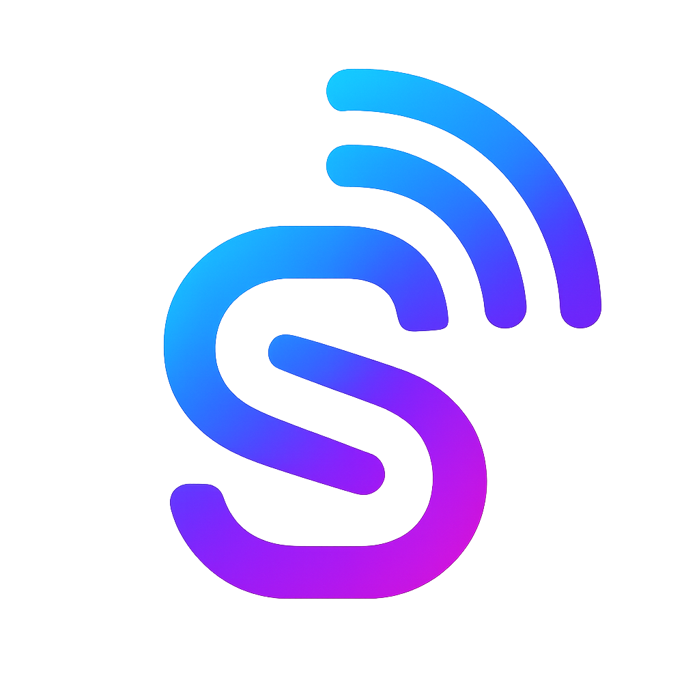
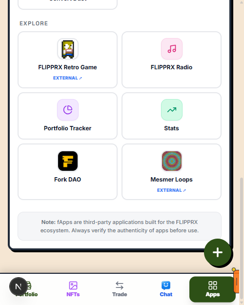
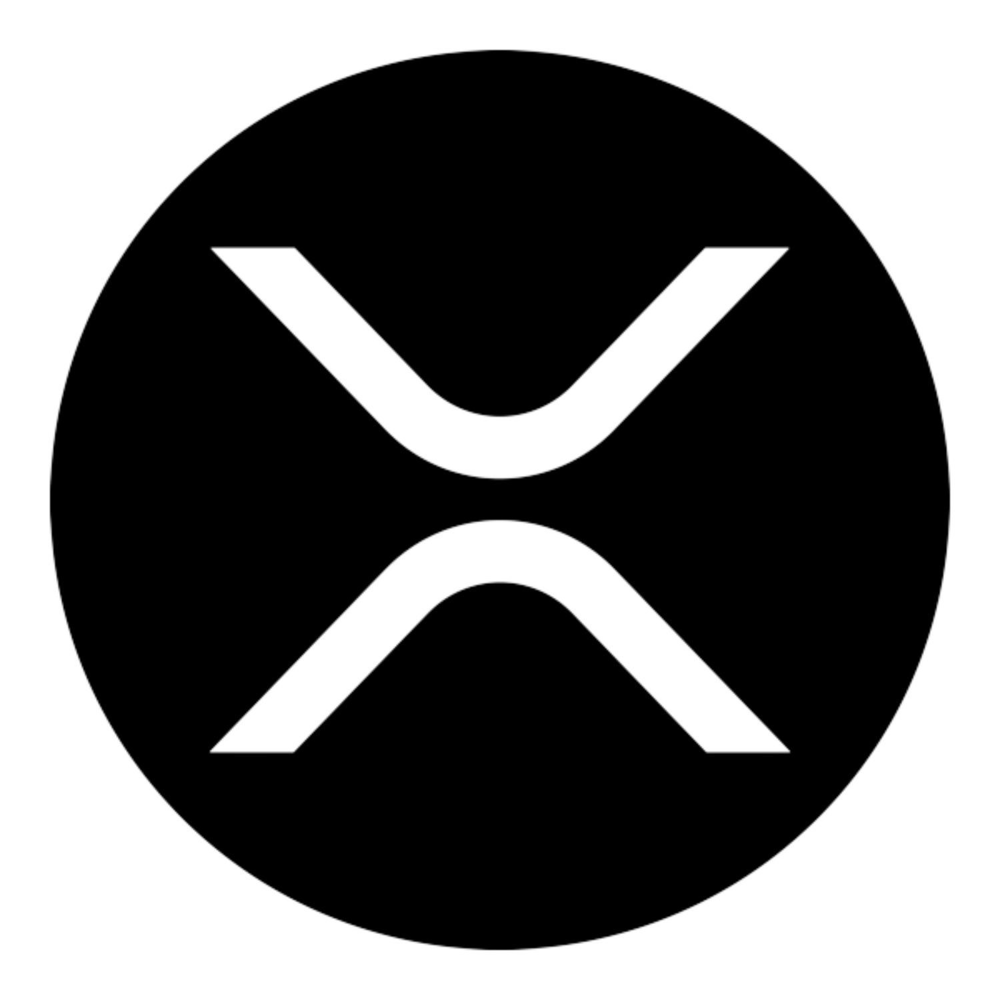
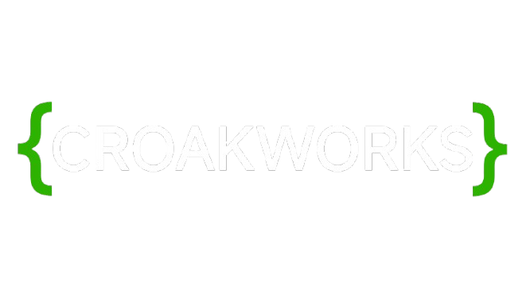

# The Gateway to Web3 🌌

**[🌐 Launch Web App](https://one.flipprx.xyz)** • **[💬 Telegram Community](https://t.me/flipprx)** • **[🐦 Follow Updates](https://twitter.com/_FLIPPRX_)**

---

## ✨ What is FLIPPRX ONE Wallet (fONE)?

**FLIPPRX ONE Wallet (fONE)** is an advanced, non-custodial wallet ecosystem running entirely inside your browser. No extensions. No accounts. With unparalleled **SnapTap WebAuth** security, a gorgeous glassmorphic interface, and a massive library of built-in Mini-dApps, fONE abstracts away the hard parts of crypto so you can focus on trading, collecting, and managing your portfolio.

### 🎯 Core Audience

- 🌐 **Web3 Explorers** - Interact across XRPL, Solana, and Bitcoin cleanly without juggling extensions.
- 🎨 **NFT Collectors** - A full built-in marketplace with zero-fee utility bonds.
- 🔒 **Privacy Advocates** - Nothing touches our servers; no email signup required.
- ⚡ **Power Traders** - Live price backgrounds, instantaneous RPC nodes, and max send metrics.

---

## 🔐 Military-Grade Security: SnapTap

Forget storing insecure 12-to-24-word seeds. FLIPPRX introduces **SnapTap KMS**:

| Technology | Action |
|-------------|--------|
| 🔑 **WebAuthn Biometrics** | Keys are sealed inside your device's Secure Enclave (FaceID / Windows Hello). |
| 🛡️ **AES-256-GCM** | Military-grade encryption payload derived locally via HKDF. |
| 📱 **Zero Backend** | 100% Client-Side. We don't have servers that hold keys—ever. |
| 👥 **Guardian Recovery** | Built-in Multi-Sig contact tools for device recovery. |

> **If your device is lost or compromised, your biometrics keep your funds inaccessible.**

---

## 🌟 The fApp Ecosystem

Why leave the wallet to use DeFi? Navigate to the "Apps" tab to seamlessly load FLIPPRX's fully localized, native toolkit:

<table>
<tr>
<td width="60%">

### 🏪 Marketplace & Commerce
- **FLIPPRX Marketplace:** Discover, buy, and sell official FLIPPRX NFTs. Features live global sales filtering, advanced Rarity scanning, and zero-fee bonding options.
- **Convert Dust (Recycle):** Turn tiny, unusable leftover asset balances scattered across trustlines into useable FLIPPRX tokens instantly.

### 🔐 Tools & Security
- **Encrypted Notes:** A highly secure notepad protected by the exact same biometric WebAuthn security as your crypto keys.
- **Account Recovery (Guardian):** Rely on trusted Multi-Sig contacts if you ever lose your device.
- **Account Tools:** Toggle advanced ledger options like DID identity flags and Deposit Preauth.

### 🏦 Advanced DeFi (XRPL Exclusives)
- **Payment Checks:** Draft a digital check on-chain. Send XRP to a recipient that they can cash whenever they want—or cancel it.
- **Scheduled Send (Escrow):** Cryptographically lock assets to be delivered on a future date.

</td>
<td width="40%" align="center">
  
   
  <i><small>The native SPA Dashboard</small></i>
</td>
</tr>
</table>

---

## ⚡ Multi-Chain Mastery

FLIPPRX supports fully independent multi-network architectures within the same single-page application experience:

- ✖️ **XRPL** - Blazing fast core ledger with token trustline handling, Escrow, Checks, and Multi-Sign functions.
- ◎ **Solana** - High-speed handling, multi-account persistence, and integrated SPL tracking.
- ₿ **Bitcoin** - Dedicated Native SegWit wallet tracking for top tier store-of-value integration.

> **Seamlessly switch networks from the unified dashboard header drop-down.**

---

## 🎨 Immersive Design: Glassmorphism UX

Crypto apps shouldn't be boring spreadsheets. 

- **Live Animated Interfaces:** Everything is wrapped in `framer-motion` for buttery smooth screen transitions. 
- **Glass-Card Aesthetics:** Outdated brutalism is gone. Enjoy premium translucent panels mapping out your wealth.
- **Background Price Alerts:** Get price fluctuations triggered directly inside your wallet via browser notification layers.
- **Unified Dashboards:** Whether you are sweeping dust, adjusting Settings, or exploring the Marketplace, the UI never kicks you to external windows.

---

## 🚀 Get Started Now

1. **Launch**: Open [FLIPPRX ONE Wallet](https://one.flipprx.xyz)
2. **Create**: Choose WebAuthn Security.
3. **Fund**: Send XRP/SOL to activate your local address.
4. **Explore**: Dive right into the Marketplace and native DeFi dApps.

 

**Built with ❤️ for the Web3 Community**

© 2026 FLIPPRX ONE. All Rights Reserved.

