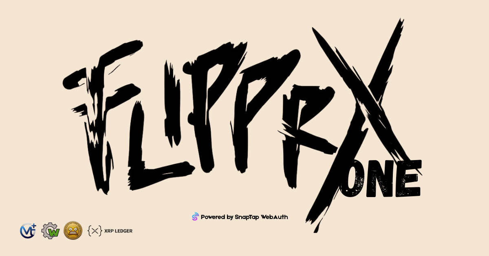

# Welcome to FLIPPRX ONE Wallet (fONE) Wiki

**FLIPPRX ONE Wallet (fONE)** is a next-generation, browser-native self-custodial wallet ecosystem. Featuring a unified glassmorphic Single Page Application (`SPA`) architecture, it supports the XRPL, Solana, and Bitcoin ledgers simultaneously—secured by **SnapTap WebAuth KMS**.

---

## 🚀 Quick Links

- **[Getting Started](Getting-Started)** - Enter the wallet in seconds. Zero registration.
- **[FAQ](FAQ)** - Find quick answers to common questions.
- **[Security & SnapTap](Security)** - Learn exactly how your biometrics protect your funds.

---

## 📖 What is the FLIPPRX Ecosystem?

FLIPPRX is not just a ledger interface. It is a full ecosystem that abstracts DeFi into a suite of native **Mini-dApps (fApps)** accessible from a unified dashboard.

- 🔐 **SnapTap WebAuth KMS** - Ditch the 12-word seeds for biometric encryption.
- 🌐 **Multi-Chain Native** - Manage XRPL, Solana (SPL), and Bitcoin (BTC Native SegWit).
- 🎨 **FLIPPRX Marketplace** - Discover, buy, and sell official FLIPPRX NFTs natively.
- 💬 **Advanced XRPL Tools** - Use Payment Checks, Escrows (Scheduled Sends), and Domains seamlessly.
- 🛡️ **Encryption Suite** - Secure your physical life with Encrypted Notes and Guardian Recovery.

---

## 🔗 Important Links

- 🌐 **Live Wallet**: [one.flipprx.xyz](https://one.flipprx.xyz)
- 🐦 **Twitter**: [@_flipprx_](https://twitter.com/_flipprx_)
- 💬 **Telegram**: [t.me/flipprx](https://t.me/flipprx)
- 📧 **Support**: admin@croak.work

---

## ⚠️ Security Notice

**FLIPPRX is fully self-custodial:**
- You alone control your private keys via your device's Secure Enclave.
- We have no backend servers processing your keys.
- **We cannot recover lost keys if your device is permanently destroyed and no Guardians are set.**
- Always enable SnapTap and Guardian Multi-Sig for maximum security.

**Built with ❤️ for the Web3 Community**
