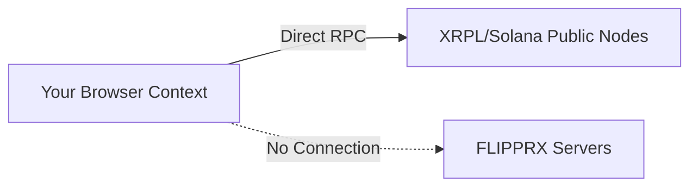

# Security Architecture

FLIPPRX Wallet does not behave like traditional custodial bank apps, nor does it behave like typical web-extension crypto wallets. Our security architecture assumes maximum hostility from the environment.

---

## 🔐 1. Zero-Backend Architecture

**We don't know who you are, and we don't know your keys.**
There is no database server maintained by FLIPPRX holding your credentials, emails, or seed phrases. The entire Single Page Application (HTML/JS/CSS) is delivered to your browser, at which point your browser natively connects directly to the blockchain.

---

## 📱 2. SnapTap WebAuth KMS

The foundational vulnerability of Crypto is the "Seed Phrase". If malware reads your clipboard while copying it, or someone takes a photo of your paper backup, your money is gone instantly.

### The Solution: Web Authentication standard (WebAuthn)

When you initialize a wallet using **SnapTap**:
1. An Entropy Seed is mathematically calculated locally in your browser's Web Crypto module.
2. We trigger the native `navigator.credentials.create()` API.
3. Your device's **Secure Enclave** (a physically isolated hardware chip within your phone/computer used for FaceID/TouchID/Windows Hello) accepts the request.
4. The Enclave creates an asymmetric keypair. It uses this to encrypt your Wallet Seed.
5. The raw Wallet Seed is wiped from browser memory.
6. The *Encrypted* Payload is saved to your browser's local storage.

### Why is this revolutionary?
Even if a hacker steals your phone, bypasses your lock screen, and extracts the encrypted payload from your browser's data directory... it's completely useless. The only way to decrypt the payload to sign a transaction is to **send it back to the Secure Enclave**, which will immediately prompt for a biometric facial scan or fingerprint. 

**Result: True Phishing-Resistant Hardware Security, built into your browser.**

---

## 🛡️ 3. UI/UX Protection Mechanisms

While SnapTap protects your keys at rest, FLIPPRX employs multiple UI mechanisms to protect you in transit:

### Clipboard Hijack Protection
Malware often monitors a computer's clipboard. When you copy an address `rFriendXYZ...`, the malware swaps it to the attacker's address `rAttacker123...`. 
When you paste an address into our Send Modals, FLIPPRX flashes a visual toast confirmation specifically alerting you to the string payload detected, forcing you to verify it wasn't manipulated.

### Automatic Inactivity Locking
If you leave a browser tab open, your session will naturally expire and the state container will wipe the decrypted ephemeral keys. Re-entering the dashboard requires tapping the "Unlock" button, which fires the biometric WebAuthn prompt again.

---

## 👥 4. Guardian Multi-Sig (Recovery)

Because SnapTap seals keys to physical hardware chips, what happens if you drop your phone in the ocean? 
With traditional wallets, you're out of luck unless you wrote down your seed. 

FLIPPRX relies on the ultimate recovery mechanism: **On-Chain Multi-Signature Guardians**.
Instead of trusting a piece of paper in your sock drawer, you can use the built-in `Account Recovery` fApp.
1. You assign trusted XRPL ledger addresses to your account (e.g., your spouse's wallet, a hardware ledger in your safe, a trusted friend).
2. If you lose your primary device, you load FLIPPRX on a brand new phone and create a completely new wallet.
3. Your Guardians formulate a transaction passing ownership of your old funds to your new phone.
4. Once the threshold of Guardians signs off, control is restored.

---

## 🚨 Summary Matrix

| Threat Vector | Traditional Wallet | FLIPPRX Wallet |
|-------------|---------------------|---------|
| Clipboard Malware | ⚠️ Users Must Check | ✅ Visual Paste Validation |
| Seed Phishing Website | ❌ Extremely Vulnerable | ✅ Impossible (WebAuthn binds to domain) |
| Device Theft | ❌ Hardware Loss = Wipe | ✅ Biometric Lock prevents drain |
| Server Database Hack | ❌ Severe Risk | ✅ Impossible (Zero Backend) |
